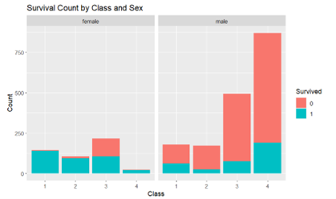
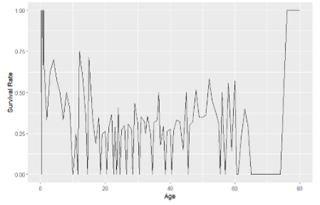

# 📈 Titanic Dataset Data Visualization Project

This project focuses on **exploratory data analysis (EDA)** and **interactive visualizations** using the Titanic dataset to uncover meaningful insights about survival patterns. The analysis was completed as part of a Data Visualization course using R and popular visualization libraries.

---

## 🔧 Technologies Used

- **R Language**
- **R Markdown (.Rmd)**
- **Libraries:** `ggplot2`, `dplyr`, `tidyverse`, `plotly`, `ggiraphExtra`, `corrplot`, `dygraphs`
- **Output Formats:** HTML, Word, and PDF

---

## 📊 Key Insights

- **Age Distribution:** Histogram reveals the majority of passengers were under 40.
- **Survival Rate by Age Group:** Young passengers (0–18) had a slightly higher survival rate.
- **Survival Rate by Gender:** Females had a significantly higher survival rate than males.
- **Survival Rate by Class:** First-class passengers had higher survival rates compared to lower classes.
- **Interactive Visualizations:** Implemented via `plotly` for dynamic insights on age, fare, class, and gender.
- **T-Test Analysis:** Compared average ages of survivors and non-survivors for statistical significance.

---

## 📅 Project Breakdown

### 1. Data Preprocessing

- Imported Titanic dataset (`Titanic.csv`)
- Filtered missing or NA values for clean analysis

### 2. Visualizations

- Age histograms, bar plots, and faceted charts
- Grouped visualizations: survival by Age, Class, Sex, Dept
- Interactive plots: Plotly bar charts and scatter plots
- Composite visual: Survival by Sex, Class, Age

### 3. Statistical Analysis

- T-test to evaluate age influence on survival probability

---

## 🖼️ Sample Visualizations

<p align="center">
  
  
</p>

---

## 💼 Project Files

| File                | Description                                  |
|---------------------|----------------------------------------------|
| `GroupProject.Rmd`  | R Markdown source code for full analysis     |
| `GroupProject.html` | Rendered HTML output                         |
| `Titanic.csv`       | Raw dataset used for visualization and EDA   |
| `*.RData`, `*.Rhistory` | RStudio workspace and session history     |

---

## ▶️ How to Run

1. **Clone the repository:**

   ```bash
   git clone https://github.com/vall9133/Visualization-of-Titanic-dataset.git
  
2.Open the .Rmd file in RStudio.  

3.Install required libraries (if not already installed):  

install.packages(c("tidyverse", "plotly", "ggplot2", "dplyr", "dygraphs", "ggiraphExtra", "corrplot"))  

4.Click "Knit" in RStudio to render the output in HTML or Word format.

